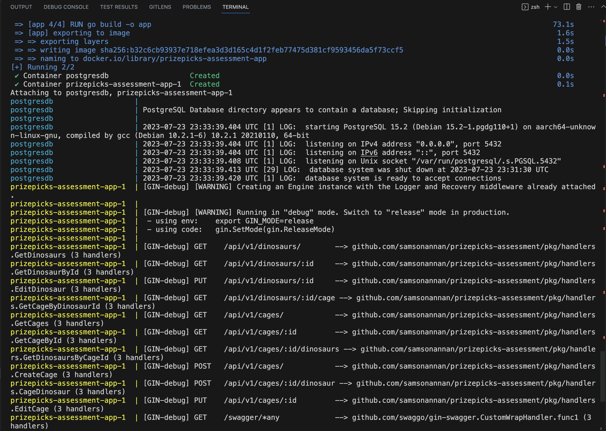
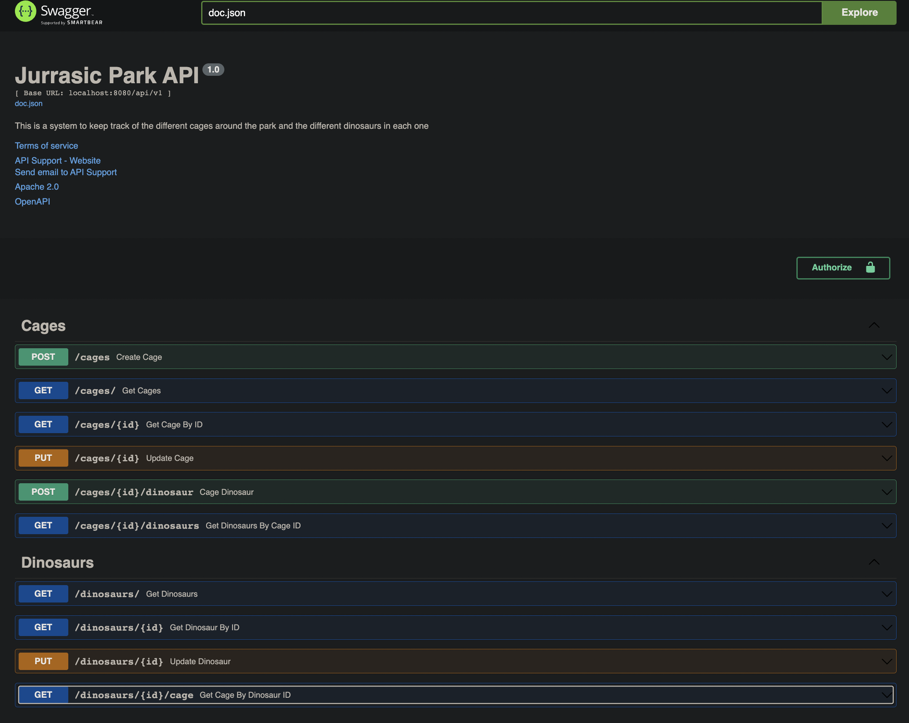

## Jurassic Park API

### Overview

It's 1993 and you're the lead software developer for the new Jurassic Park! Park operations. Exciting times.
needs a system to keep track of the different cages around the park and the different dinosaurs
in each one. You'll need to develop a JSON formatted RESTful API to allow the builders to create
new cages. It will also allow doctors and scientists the ability to edit/retrieve the statuses of
dinosaurs and cages. Awesome. Coooooolllllll.

### Business Requirements

- All requests should respond with the correct HTTP status codes and a response, if necessary,
representing either the success or error conditions.
- Data should be persisted using some flavor of SQL.
- Each dinosaur must have a name.
- Each dinosaur is considered an herbivore or a carnivore, depending on its species.
- Carnivores can only be in a cage with other dinosaurs of the same species.
- Each dinosaur must have a species (See enumerated list below, feel free to add others).
- Herbivores cannot be in the same cage as carnivores.
- Use Carnivore dinosaurs like Tyrannosaurus, Velociraptor, Spinosaurus and Megalosaurus.
- Use Herbivores like Brachiosaurus, Stegosaurus, Ankylosaurus and Triceratops.

### Quickstart

- Technical Requirements: Golang 1.19 and Docker Engine 23.0+
  
```sh
$ git clone github.com/samsonannan/prizepicks-assessment
$ cd prizepicks-assessment

# postgres db running on default port:5432
# docker-compose env file provided containing ${POSTGRES_USER} ${POSTGRES_HOST} ${POSTGRES_PASSWORD}
# modify .env file if configurations differ
$ docker-compose --env-file .env up
```




- Once both services are running, go to http://localhost:8080/swagger/index.html to view API docs
  



- Open a new terminal and run the following cURL commands. ID will be unique for every output
  
```sh
$ curl --location 'http://localhost:8080/api/v1/cages' \
--header 'Content-Type: application/json' \
--data '{
  "capacity": 5,
  "status": "ACTIVE"
}'
# Output
# {
#     "status": true,
#     "data": {
#         "id": "f9a5eda7-b279-4738-abc0-5eb9a923278c",
#         "created_at": "2023-07-24T00:39:06.754958Z",
#         "updated_at": "2023-07-24T00:39:06.754958Z",
#         "capacity": 5,
#         "status": "ACTIVE",
#         "edges": {}
#     },
#     "error": ""
# }

$ curl --location 'http://localhost:8080/api/v1/cages' \
--header 'Content-Type: application/json' \
--data '{
  "capacity": 5,
}'
# Output
# {
#     "status": true,
#     "data": {
#         "id": "dd01a5eda7-b279-473sd-abc0-5eb98102327b",
#         "created_at": "2023-07-24T00:40:06.754958Z",
#         "updated_at": "2023-07-24T00:40:06.754958Z",
#         "capacity": 5,
#         "status": "ACTIVE",
#         "edges": {}
#     },
#     "error": ""
# }

$ curl --location 'http://localhost:8080/api/v1/cages' \
--header 'Content-Type: application/json' \
--data '{
  "status": "ACTIVE"
}'
# Output
# {
#     "status": false,
#     "data": null,
#     "error": "capacity: cannot be blank."
# }

$ curl --location 'http://localhost:8080/api/v1/cages' \
--header 'Content-Type: application/json' \
--data '{}'
# Output
# {
#     "status": false,
#     "data": null,
#     "error": "capacity: cannot be blank."
# }

$ curl --location 'http://localhost:8080/api/v1/cages' \
--header 'Content-Type: application/json' \
--data '{
    "capacity": 8,
    "status": OFF
}'
# Output
# {
#     "status": false,
#     "data": null,
#     "error": "status: must be a valid value."
# }

curl --location 'http://localhost:8080/api/v1/cages' \
--header 'Content-Type: application/json' \
--data '{
  "capacity": 10,
  "status": "DOWN"
}'
# Output
# {
#     "status": true,
#     "data": {
#         "id": "5eb9a923278c-b279-4738-abc0-5f9a5eda7c",
#         "created_at": "2023-07-24T00:41:06.754958Z",
#         "updated_at": "2023-07-24T00:41:06.754958Z",
#         "capacity": 10,
#         "status": "DOWN",
#         "edges": {}
#     },
#     "error": ""
# }
```

### Implementation

The solution for Jurassic Park problem is implemented using the Gin framework and the Ent ORM (Object-Relational Mapping) library. The main components of the solution are:

- Gin Framework: Gin is a lightweight and fast web framework for Go, used to handle HTTP requests and responses. It provides routing, middleware support, and easy JSON handling.
- Ent ORM: Ent is an ORM library for Go that simplifies working with databases. It automatically generates Go code based on the database schema and provides a clean API to interact with the database.
- Database Schema: The solution involves two main entities - Cage and Dinosaur. The database schema is defined using the Ent ORM, and each entity has various fields such as ID, Capacity, Status, Size, Name, Species, and Group.
- API Endpoints: The Gin router is used to define several API endpoints to perform CRUD (Create, Read, Update, Delete) operations on the Cage and Dinosaur entities. For example, POST /cages to create a new cage, GET /cages/:id to get a cage by its ID, POST /dinosaurs to add a new dinosaur, and so on.
- Handlers: Each API endpoint is associated with a handler function that processes the incoming request. These handler functions use the Ent ORM to interact with the database, validate the request data, and send appropriate responses.
- Error Handling: The solution handles errors gracefully by returning appropriate HTTP status codes and error messages in the response. It logs errors using the SugaredLogger from Zap (logging library) to help with debugging.
- Testing: The solution includes unit tests for various functions, endpoints, and validation logic to ensure the correctness and reliability of the code. Test cases cover both valid and invalid scenarios to verify the error handling.

Overall, the Gin and Ent combination provides a powerful and efficient way to build a web API for managing cages and dinosaurs. The use of ORM simplifies database interactions, and the Gin framework provides a clean and fast way to handle HTTP requests and build RESTful APIs. Additionally, the validation and error handling ensure that the API remains robust and provides meaningful feedback to clients.

### Postman Collection

All testcases and examples are provided in a postman collection JSON file `jurassic_park_apis.postman_collection.json`. Input data, query parameters and/or request payloads can be modified based on usecase. Can be imported into Postman

### Note

- No POST method is provided for Dinosaur base endpoint. This is because we assume dinosaurs cannot roam freely, and that a new dinosaur entry is only created when it is being assigned a cage. Thus we use `POST {baseURL}/cages/{cage_id}/dinosaur`. This creates a new dinosaur entry and assigns it to cage with `cage_id`.
- Cages have a maximum capacity for how many dinosaurs it can hold.
- Cages know how many dinosaurs are contained.
- Cages have a power status of ACTIVE or DOWN.
- Cages cannot be powered off if they contain dinosaurs.
- Dinosaurs cannot be moved into a cage that is powered down.
- Must be able to query a listing of dinosaurs in a specific cage.
- When querying dinosaurs or cages they should be filterable on their attributes (Cages on their
power status and dinosaurs on species).

```sh
# Testing
$ go test ./...
```
